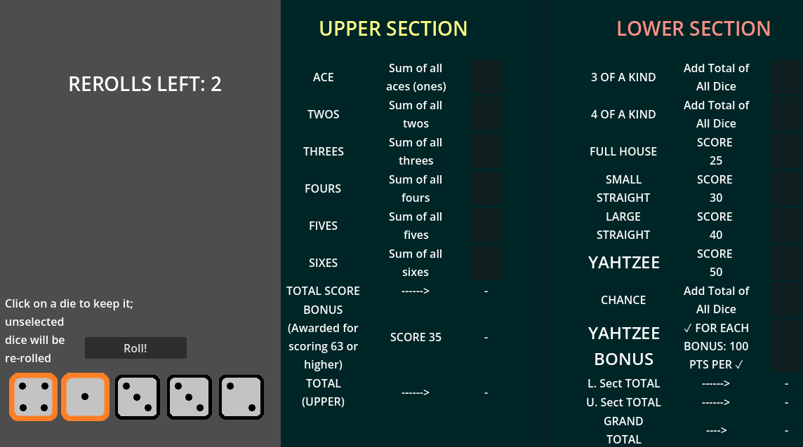

# Yahtzee
An attempt at implementing a Yahtzee game in Godot.

What it looks like outside the box:

To test it out:

-Clone the project
-open the project.godot file in Godot (v4.7 or later)

2026-08-25: Presently the plan is to get a full game-loop before closing the project.
